# **Bus Reservation System | BCA 4th Semester Project (TU)**

A comprehensive bus reservation platform built with **native PHP, MySQL, HTML, CSS, and JavaScript** following modular architecture without frameworks. Features role-based access (Admin/User), seat selection, and payment integration.

Live Demo :(Bus Sewa) [https://bussewa.infinityfreeapp.com/BCA-4TH-PROJECT-BUS-RESERVATION/pages/public/home.php]

<p align="center">
  
  
  
</p>

---

## 📋 **Table of Contents**
- [Features](#-features)
- [Screenshots](#-screenshots)
- [Installation](#-installation--setup)
- [Project Structure](#-project-structure)
- [System Architecture](#-system-architecture)
- [Payment Integration](#-esewa-payment-integration)
- [Usage Guide](#-usage-guide)
- [API Endpoints](#-api-endpoints)
- [Future Enhancements](#-future-enhancements)

---

## ✨ **Features**

### **👤 User Features**
- User registration & login with validation
- Browse available buses with filters
- Interactive seat selection interface
- Real-time seat availability check
- Reservation history & tracking
- Profile management
- Secure payment integration (Esewa/Cash)
- PDF ticket generation

### **👨‍💼 Admin Features**
- Dashboard with analytics
- Bus management (CRUD operations)
- User management
- View all reservations
- Manage seat configurations
- Payment status tracking

---


## 📸 Screenshots

### 🌐 Public Pages

| Home                             | Login                              | Register                                 | About                              | Contact                                    |
| -------------------------------- | ---------------------------------- | ---------------------------------------- | ---------------------------------- | ------------------------------------------ |
| 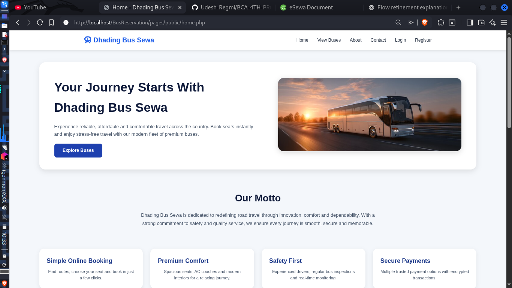 | 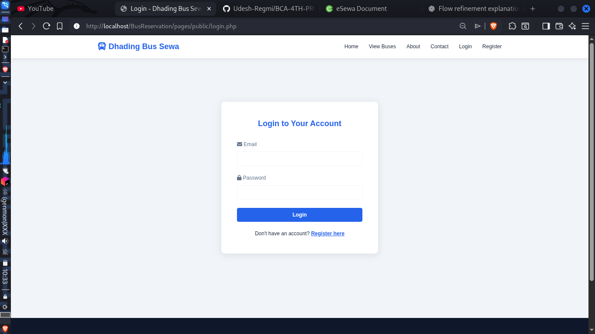 | 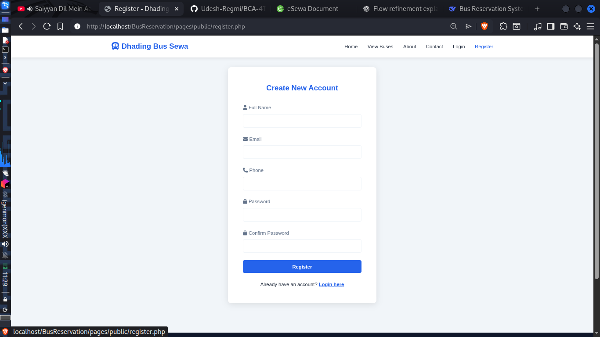 | 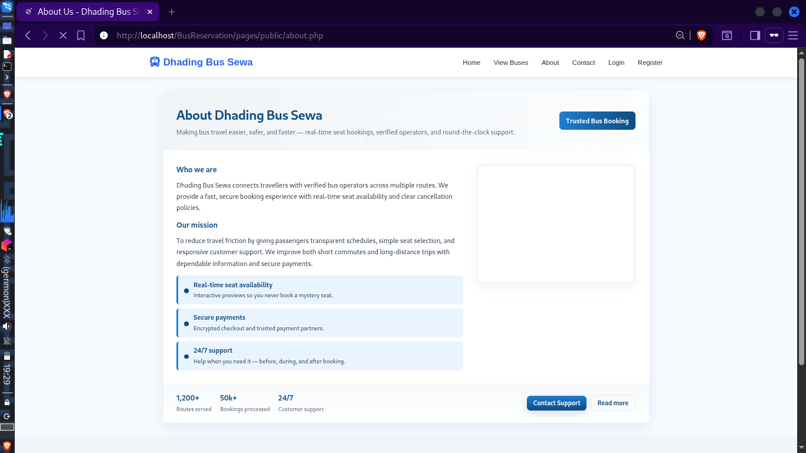 | 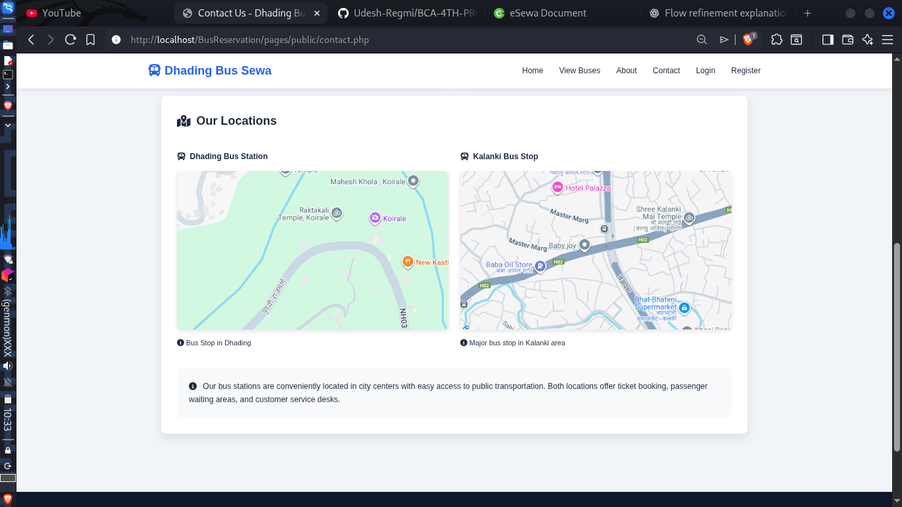 |

---

### 👤 User Dashboard

| Dashboard                                      | View Buses                                | Seat Selection                                |
| ---------------------------------------------- | ----------------------------------------- | --------------------------------------------- |
| 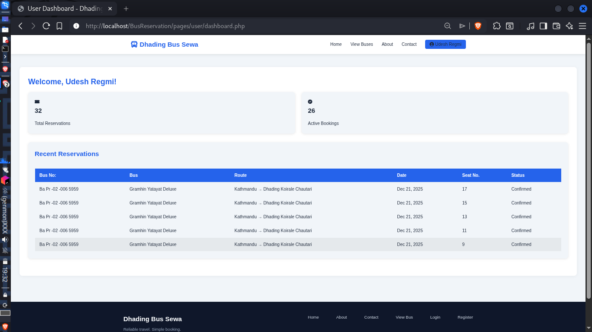 | 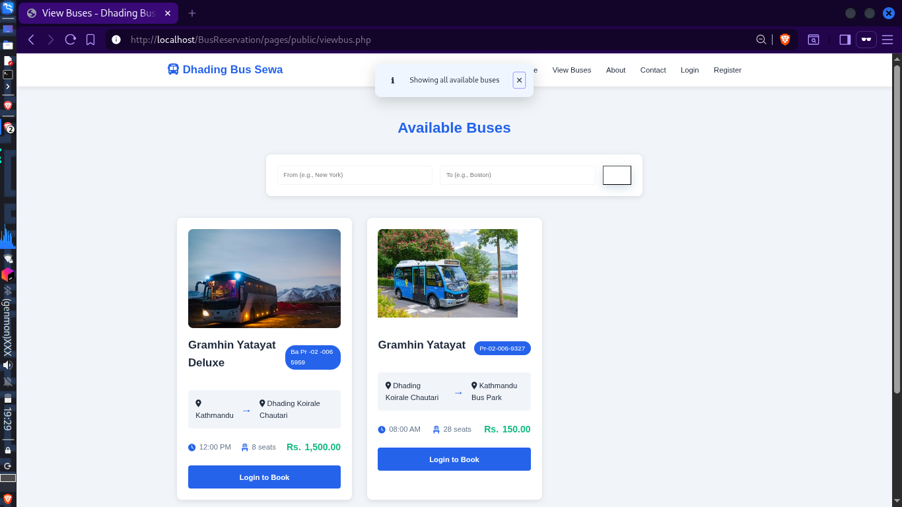 | 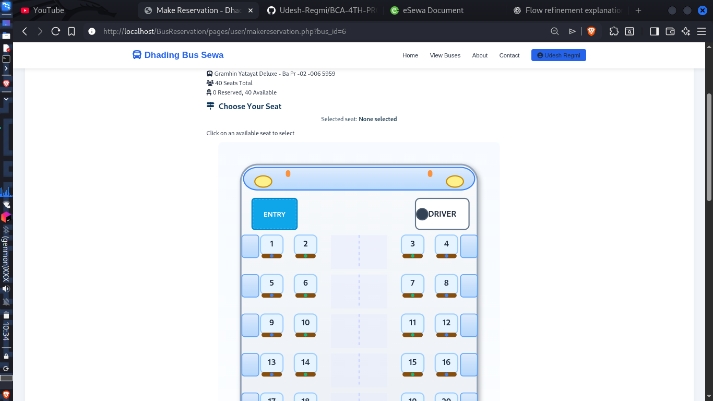 |

| Seat Layout (Alt View)                      | Reservations                                               | Print Ticket                                               |
| ------------------------------------------- | ---------------------------------------------------------- | ---------------------------------------------------------- |
| 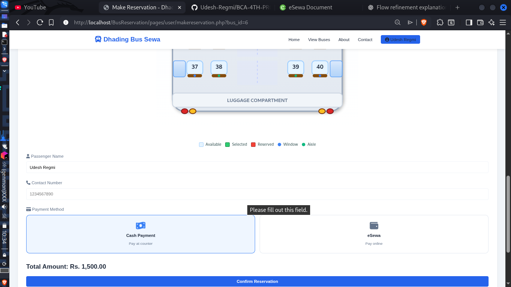 | 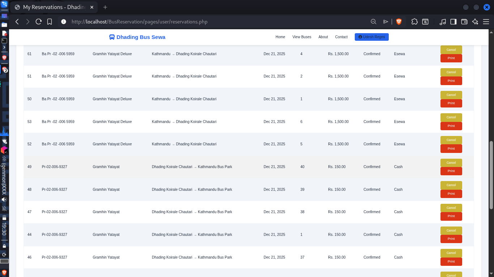 | 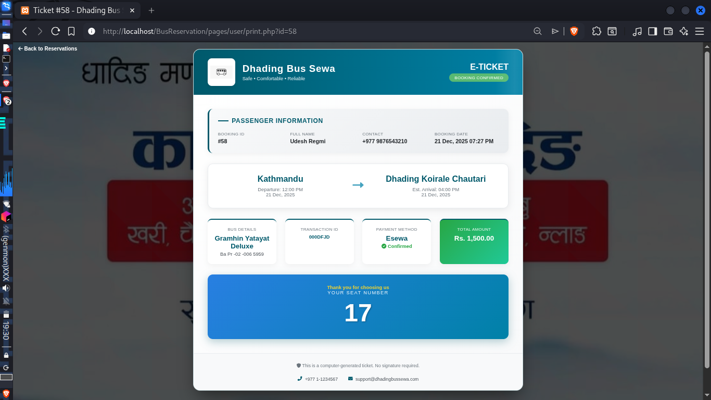 |

---

### 🛠️ Admin Panel

| Admin Dashboard                                        | Manage Buses                                   | Add Bus                                |
| ------------------------------------------------------ | ---------------------------------------------- | -------------------------------------- |
| 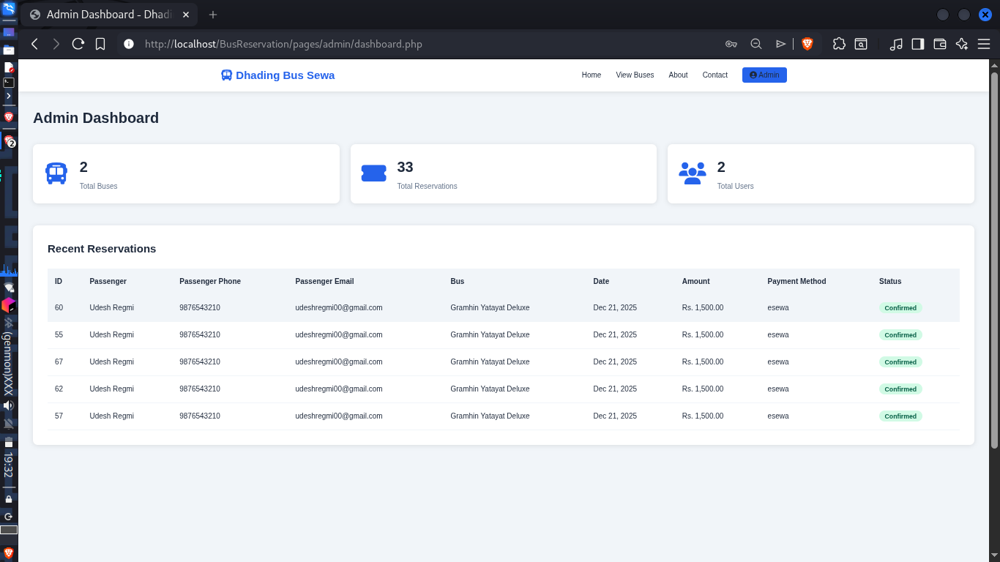 | 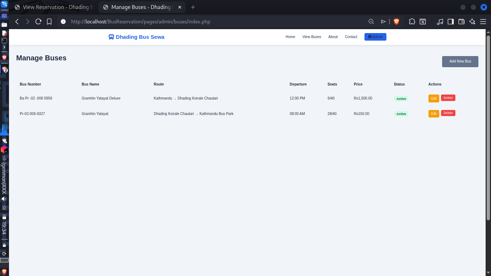 | 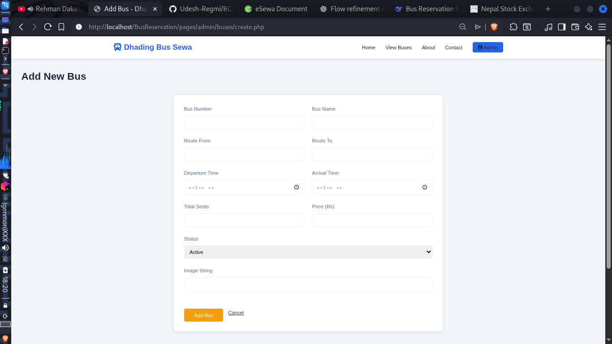 |

| Edit Bus                                | Manage Reservations                                            | Admin Print Ticket                                           |
| --------------------------------------- | -------------------------------------------------------------- | ------------------------------------------------------------ |
| 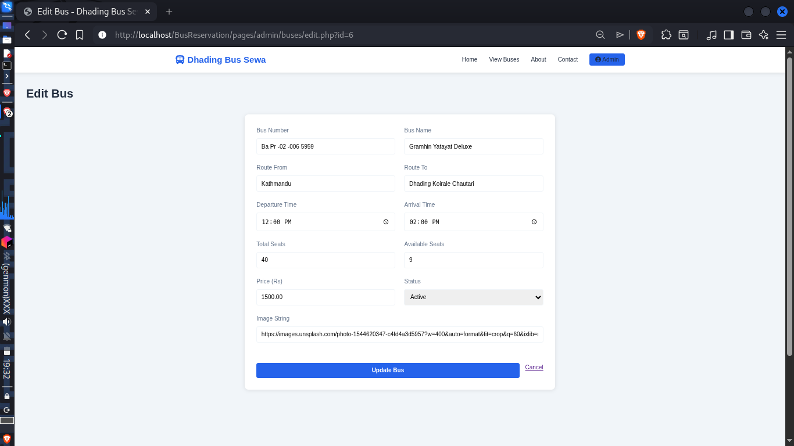 | 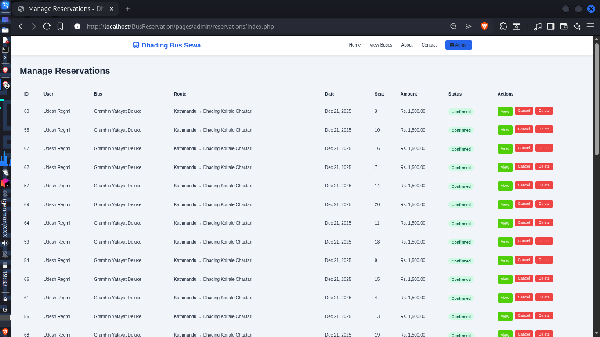 | 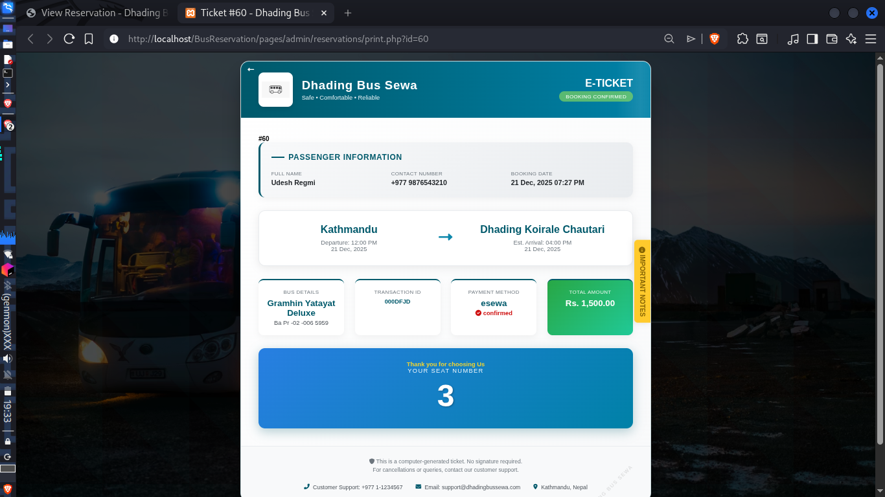 |

---


## 🚀 **Installation & Setup**

### **Prerequisites**
- PHP 7.4 or higher
- MySQL 5.7 or higher
- Apache/Nginx web server
- Composer (optional)

### **Step-by-Step Installation**

1. **Clone the repository**
```bash
git clone https://github.com/Udesh-Regmi/BCA-4TH-PROJECT-BUS-RESERVATION
cd BCA-4TH-PROJECT-BUS-RESERVATION
```

2. **Database Setup**
```sql
-- Create database
CREATE DATABASE bus_reservation;

-- Import provided SQL file
mysql -u root -p bus_reservation < database/bus_reservation.sql
```

3. **Configure Database**
Edit `config/database.php`:
```php
private $host = "localhost";
private $db_name = "bus_reservation";
private $username = "root";      // Your MySQL username
private $password = "";          // Your MySQL password
```

4. **Configure Base URL**
Update constants in `config/constants.php`:
```php
define('BASE_URL', 'http://localhost/BusReservation/');
define('SITE_NAME', 'Bus Reservation System');
```

5. **Set Permissions**
```bash
chmod 755 -R uploads/
chmod 644 config/database.php
```

6. **Start Development Server**
```bash
# For PHP built-in server
php -S localhost:8000

# Or configure with Apache
# DocumentRoot should point to project root
```

7. **Access Application**
- Open browser: `http://localhost:8000`
- **Admin Login**: admin@bus.com / admin123
- **User Login**: user@bus.com / user123

---

## 📁 **Project Structure**
```
BusReservation/
    ├── Readme.md
    ├── UI
    │   ├── components
    │   │   ├── Alert.php
    │   │   ├── Footer.php
    │   │   ├── Header.php
    │   │   ├── Navbar.php
    │   │   └── SideBar.php
    │   ├── css
    │   │   ├── admin.css
    │   │   ├── style.css
    │   │   └── user.css
    │   └── js
    │       ├── admin.js
    │       ├── main.js
    │       └── validation.js
    ├── api
    │   ├── auth.php
    │   ├── buses.php
    │   └── reservations.php
    ├── config
    │   ├── constants.php
    │   └── database.php
    ├── controllers
    │   ├── AuthController.php
    │   ├── BusController.php
    │   ├── EsewaController.php
    │   ├── ReservationController.php
    │   └── UserController.php
    ├── debugnav.php
    ├── includes
    │   ├── functions.php
    │   └── session.php
    ├── middleware
    │   ├── admin.php
    │   └── auth.php
    ├── models
    │   ├── Bus.php
    │   ├── Reservation.php
    │   └── User.php
    ├── pages
    │   ├── admin
    │   │   ├── buses
    │   │   │   ├── create.php
    │   │   │   ├── delete.php
    │   │   │   ├── edit.php
    │   │   │   └── index.php
    │   │   ├── dashboard.php
    │   │   ├── reservations
    │   │   │   ├── index.php
    │   │   │   └── view.php
    │   │   └── users
    │   │       ├── index.php
    │   │       └── manage.php
    │   ├── payment
    │   │   ├── esewa-failure.php
    │   │   └── esewa-success.php
    │   ├── public
    │   │   ├── 404.php
    │   │   ├── about.php
    │   │   ├── contact.php
    │   │   ├── home.php
    │   │   ├── login.php
    │   │   ├── register.php
    │   │   └── viewbus.php
    │   └── user
    │       ├── dashboard.php
    │       ├── makereservation.php
    │       ├── profile.php
    │       ├── reservation_history.php
    │       └── reservations.php
    ├── test.php
    └── testcrud.php

19 directories, 55 files
```

---

## 🏗️ **System Architecture**

### **MVC-like Pattern**
```
┌─────────────────────────────────────────────────────────┐
│                    PRESENTATION LAYER                    │
│  (pages/*, UI/components/*, UI/css/*, UI/js/*)          │
└───────────────────────────┬─────────────────────────────┘
                            │ HTTP Requests/Responses
┌───────────────────────────▼─────────────────────────────┐
│                    API/ROUTING LAYER                     │
│  (api/*.php - RESTful endpoints)                        │
└───────────────────────────┬─────────────────────────────┘
                            │ Method Calls
┌───────────────────────────▼─────────────────────────────┐
│                  CONTROLLER LAYER                        │
│  (controllers/*.php - Business logic)                   │
└───────────────────────────┬─────────────────────────────┘
                            │ Model Interactions
┌───────────────────────────▼─────────────────────────────┐
│                    MODEL LAYER                           │
│  (models/*.php - Database operations)                   │
└───────────────────────────┬─────────────────────────────┘
                            │ SQL Queries
┌───────────────────────────▼─────────────────────────────┐
│                  DATABASE LAYER                          │
│  (MySQL Database)                                        │
└─────────────────────────────────────────────────────────┘
```

### **Request Flow Example**
1. **User Action**: User clicks "Book Seat"
2. **Frontend**: JavaScript sends AJAX request to `api/reservations.php`
3. **API Layer**: Validates input, calls `ReservationController`
4. **Controller**: Business logic validation, calls `Reservation` model
5. **Model**: Database operations (check availability, insert record)
6. **Response**: JSON response sent back to frontend
7. **UI Update**: JavaScript updates seat status

---


### **Database Schema Relationships**
- One User → One Reservations
- One Bus → Many Reservations
- Reservation belongs to one User and one Bus

---

## 💳 **Esewa Payment Integration**

### **Test Credentials**
```
eSewa ID: 9806800001/2/3/4/5
Password: Nepal@123
MPIN: 1122
Merchant ID/Service Code: EPAYTEST
Token:123456
```

### **Payment Flow**
1. User selects payment method → Esewa
2. System generates payment request with unique PID
3. Redirect to Esewa test environment
4. User enters test credentials
5. Esewa callback to success/failure endpoints
6. System updates payment status

### **Configuration**
Update in `controllers/EsewaController.php`:
```php
private $merchantCode = "EPAYTEST";
private $successUrl = "http://localhost/BusReservation/pages/payment/esewa-success.php";
private $failureUrl = "http://localhost/BusReservation/pages/payment/esewa-failure.php";
private $esewaUrl = "https://rc-epay.esewa.com.np/api/epay/main/v2/form";
```

---

## 📖 **Usage Guide**

### **For Users**
1. **Registration**: Create account with valid email
2. **Browse Buses**: Use filters to find available buses
3. **Select Seats**: Interactive seat map (green=available, red=booked)
4. **Make Payment**: Choose Esewa (test mode) or Cash on Board
5. **View Tickets**: Access reservation history with details

### **For Admin**
1. **Login**: Use admin credentials
2. **Dashboard**: View system statistics
3. **Manage Buses**: Add/edit/remove bus schedules
4. **Monitor Reservations**: View all bookings
5. **User Management**: Manage user accounts


## 🚧 **Future Enhancements**

### **Short-term Goals**
- [ ] Email notification system
- [ ] PDF ticket generation
- [ ] Advanced search filters
- [ ] User rating and reviews
- [ ] Password reset functionality

### **Medium-term Goals**
- [ ] Mobile-responsive design improvements
- [ ] Real-time seat updates with WebSockets
- [ ] Multiple payment gateways (Khalti, IME Pay)
- [ ] Booking cancellation with refund policy
- [ ] Admin report generation (PDF/Excel)

### **Long-term Goals**
- [ ] Mobile application (React Native)
- [ ] Microservices architecture
- [ ] Machine learning for demand prediction
- [ ] API documentation with Swagger
- [ ] Docker containerization

### **Technical Improvements**
- [ ] Implement proper ORM (Doctrine)
- [ ] Add unit tests (PHPUnit)
- [ ] Implement caching (Redis)
- [ ] REST API versioning
- [ ] Rate limiting and API security

---

## 🛠️ **Troubleshooting**

### **Common Issues**

1. **Database Connection Failed**
   - Check MySQL service is running
   - Verify credentials in `config/database.php`
   - Ensure database exists

2. **Session Issues**
   - Check `session_start()` in included files
   - Verify file permissions for session storage

3. **Esewa Payment Failing**
   - Verify test credentials
   - Check callback URLs are accessible
   - Ensure PID is unique for each transaction

4. **Seat Availability Not Updating**
   - Check reservation status updates
   - Verify database triggers (if any)
   - Clear browser cache

### **Debug Mode**
Enable debug mode in `config/constants.php`:
```php
define('DEBUG_MODE', true);
error_reporting(E_ALL);
ini_set('display_errors', 1);
```

---

## 📚 **Documentation & Resources**

### **For Developers**
- [PHP Official Documentation](https://www.php.net/docs.php)
- [MySQL Documentation](https://dev.mysql.com/doc/)
- [Esewa API Documentation](https://developer.esewa.com.np/)

### **Learning Resources**
- PHP Basics: W3Schools PHP Tutorial
- MySQL: MySQL Tutorial
- Frontend: MDN Web Docs

---

## 🤝 **Contributing**


1. Fork the repository
2. Create feature branch (`git checkout -b feature/AmazingFeature`)
3. Commit changes (`git commit -m 'Add AmazingFeature'`)
4. Push to branch (`git push origin feature/AmazingFeature`)
5. Open Pull Request

---

## 📄 **License**

This project is created for educational purposes as part of BCA 4th Semester (Tribhuvan University). Feel free to use and modify for academic purposes.

---

## 👨‍🏫 **Academic Information**

**Course**: BCA 4th Semester  
**University**: Tribhuvan University  
**Subject**: Project -I
**Year**: 2026  
**Team**: [Udesh Regmi, Sangam Sedai]

---

## 📞 **Contact & Support**

For queries related to this project:
- **Email**: [udesh.regmi.mail@gmail.com]
- **LinkedIn** [https://www.linkedin.com/in/udesh-regmi/]
- **GitHub Issues**: [Create Issue](https://github.com/Udesh-Regmi/BCA-4TH-PROJECT-BUS-RESERVATION/issues)
- **University**: Department of Humanities and Social Science, TU

---

## 🙏 **Acknowledgments**

- Tribhuvan University for curriculum
- Esewa for test payment integration
- Open source community for resources
- Project supervisor for guidance

---
